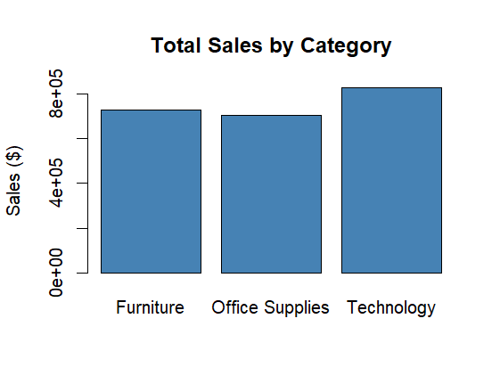
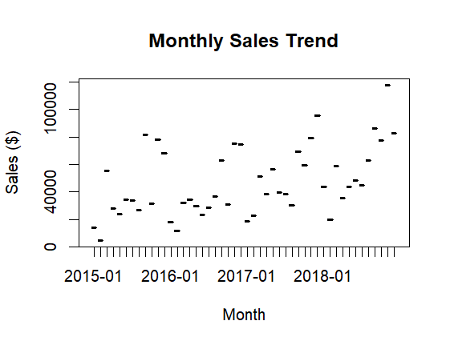

# Retail Sales Analysis (R) 📊

Exploratory data analysis of retail sales data using R, examining revenue by category, region, and monthly trends across a 4-year period.

## 🎯 The Problem
I wanted to identify which product categories and regions drive the most revenue, and whether sales show any clear trend over time — the kind of question a retail business would actually ask before making inventory or marketing decisions.

## 📂 Dataset
**Superstore Sales Dataset** (9,800 orders, 2015–2018) — sourced from Kaggle.

## 📈 Key Findings
- **Technology** generated the highest total sales ($827,456), narrowly ahead of **Furniture** ($728,659) and **Office Supplies** ($705,422)
- The **West** region led with $710,220 in sales, while **South** trailed at $389,151 — less than half of the West's total
- **Fasteners** was the lowest-performing sub-category by far, at just $3,002 in total sales
- Monthly sales show a clear upward trend from 2015 to 2018, peaking in **November 2018** ($117,938) — nearly 26x higher than the lowest month (February 2015, $4,520)

## 🖼️ Visuals

### Sales by Category

### Monthly Sales Trend

## 🧰 Built With
- R / RStudio
- Base R functions: `aggregate()`, `barplot()`, `plot()`

## 🚀 How to Run
1. Clone this repo
2. Open `sales_analysis.R` in RStudio
3. Update the file path in `read.csv()` to point to your local copy of the dataset
4. Run the script — it will generate both charts

## 🔮 Future Improvements
- Add a regression line to quantify the growth trend
- Investigate the seasonal spike pattern (e.g. why November consistently peaks)

---
*Built by Shams Asadova*
